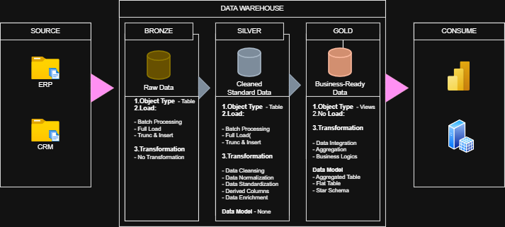
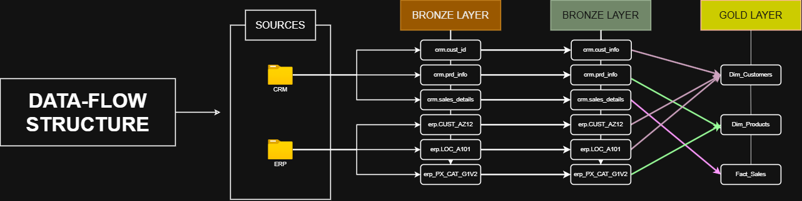
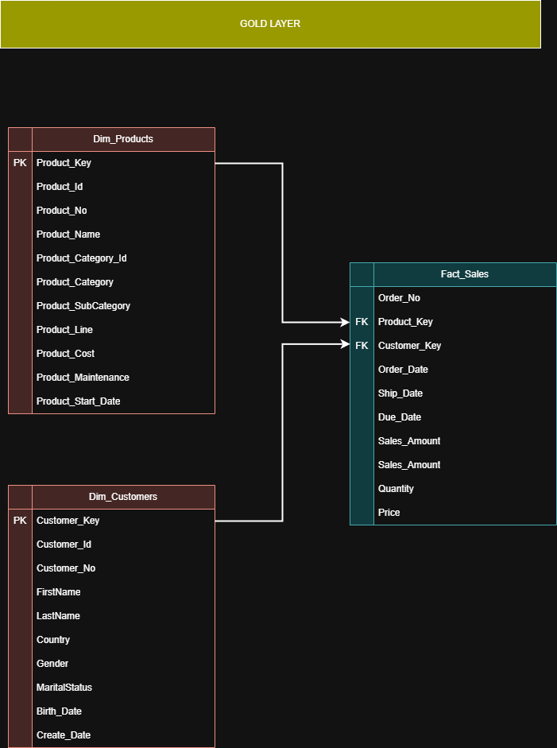

# SQL Data Warehouse | Medallion Architecture

An end-to-end SQL Server Data Warehouse project built using the **Medallion Architecture** (Bronze, Silver, Gold) to demonstrate modern data engineering concepts including ETL development, data cleansing, dimensional modeling, and business-ready reporting.

---
## Quick Metrics

| Metric | Value |
|--------|------:|
| Source Systems | 2 (CRM, ERP) |
| Warehouse Layers | 3 (Bronze, Silver, Gold) |
| Source Tables | 6 |
| Gold Views | 3 |
| Dimensions | 2 |
| Fact Tables | 1 |
| ETL Scripts | 3 |
| Architecture Diagrams | 4 |

## Project Overview

This project simulates a real-world data warehouse by integrating data from multiple source systems (CRM and ERP) into a centralized analytical model.

The warehouse is designed using a layered architecture:

- **Bronze** – Raw data ingestion
- **Silver** – Cleansed and standardized data
- **Gold** – Business-ready dimensional model optimized for analytics

The final Gold layer follows a **Star Schema** consisting of conformed dimensions and a centralized fact table suitable for reporting tools such as Power BI.

---

# Project Structure

```
SQL-Data-Warehouse
│
├── datasets/
│
├── scripts/
│   ├── Bronze Layer/
│   │   ├── DDL,ETL.sql
│   │   └── Stored-Procedure-BL.sql
│   ├── Silver Layer/
│   │   ├── Silver-DDL.sql
│   │   └── Silver-SP_ETL.sql
│   └── Gold Layer/
│       └── Gold_Views.sql
│
├── docs/
│   ├── Gold_Data_Catalog.md
│   └── images/
│
├── README.md
└── LICENSE
```

---

## Architecture

<p align="center">

</p>


# Source Systems

| Source | Description |
|----------|------------|
| CRM | Customer, Product and Sales transactions |
| ERP | Customer demographics, Locations and Product Categories |

---

## Data Flow

<p align="center">

</p>

---

# Medallion Architecture

## Bronze Layer

Purpose

- Store raw source data
- Preserve source integrity
- Minimal transformations
- Support full and incremental loads

### Characteristics

- Raw tables
- Truncate & Insert
- Batch Processing
- No business logic

---

## Silver Layer

Purpose

- Cleanse data
- Standardize formats
- Validate business rules
- Prepare trusted datasets

### Transformations

- Data Cleansing
- Standardization
- Normalization
- Derived Columns
- Data Enrichment
- Duplicate Handling

---

## Gold Layer

Purpose

Provide business-ready datasets optimized for reporting and analytics.

### Design Principles

- Star Schema
- Business-friendly naming
- Conformed Dimensions
- Fact Table
- Analytical Model

---

# Gold Layer Data Model

<p align="center">

</p>

---

# Technologies Used

- SQL Server
- T-SQL
- SQL Server Management Studio (SSMS)
- Draw.io
- Git
- GitHub

---

# Skills Demonstrated

- Data Warehousing
- ETL Development
- SQL Programming
- Data Cleansing
- Data Standardization
- Data Modeling
- Star Schema
- Surrogate Keys
- Window Functions
- Stored Procedures
- Data Validation
- Business Rule Implementation

---

# Documentation

| Document | Purpose |
|-----------|---------|
| Gold Data Catalog | Gold layer metadata and column definitions |
| Business Rules | Transformation logic |
| Data Quality | Validation rules |
| Naming Standards | Warehouse naming conventions |

# About Me

Hi, I'm **Arpit Panchal**, an aspiring Data Engineer with a passion for designing scalable data solutions.

This project was designed and developed to demonstrate practical data engineering skills, including:

- Designing a Medallion Architecture (Bronze, Silver, Gold)
- Building end-to-end ETL pipelines using T-SQL
- Implementing data cleansing and business transformation logic
- Developing a dimensional model using a Star Schema
- Creating enterprise-style technical documentation and data catalog
- Applying data quality checks and business rules

The goal of this project is to showcase how raw operational data can be transformed into trusted, analytics-ready datasets for business intelligence and reporting.

**GitHub:** [Baka-Spade](https://github.com/Baka-Spade)
---

## License

This project is licensed under the MIT License.
